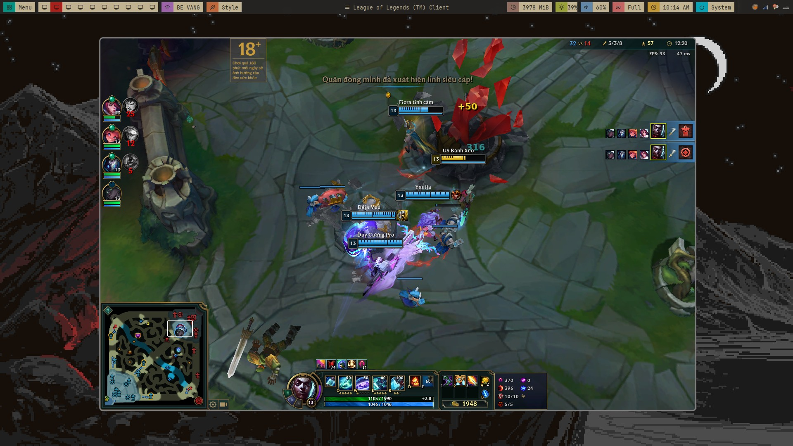
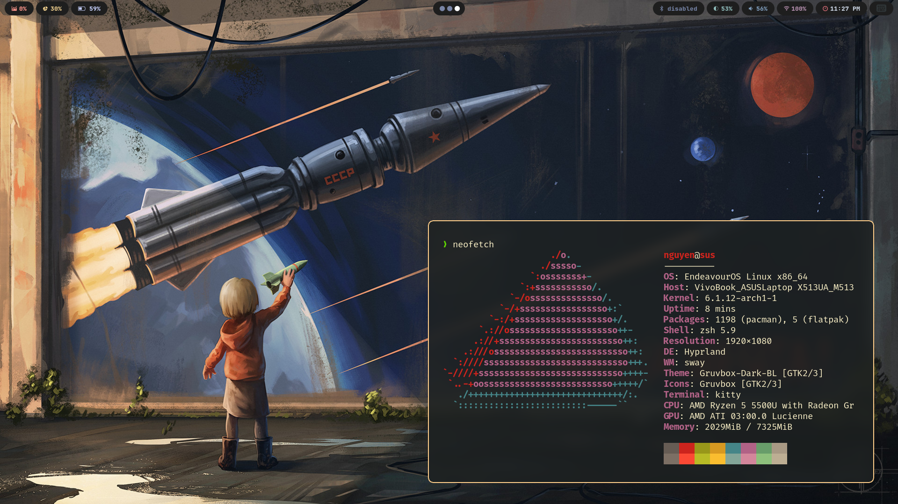

### Bspwm



### Hyprland



### Set up hyprland

#### Dependencies
```
yay --needed -S polkit-kde-agent dunst grim rofi-lbonn-wayland-git rofi-emoji \
wl-clipboard wf-recorder hyprpicker-git hyprpaper-git \
xdg-desktop-portal-hyprland-git ffmpegthumbnailer tumbler  \
swaylock-effects qt5-wayland qt6-wayland ripgrep  \
thunar thunar-archive-plugin file-roller wtype colord \
waybar-hyprland-git
```

#### Fonts
```
yay --needed -S ttf-jetbrains-mono ttf-jetbrains-mono-nerd noto-fonts-emoji
```
